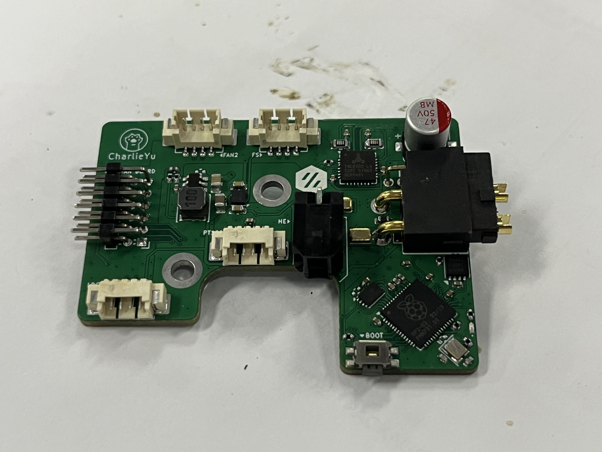
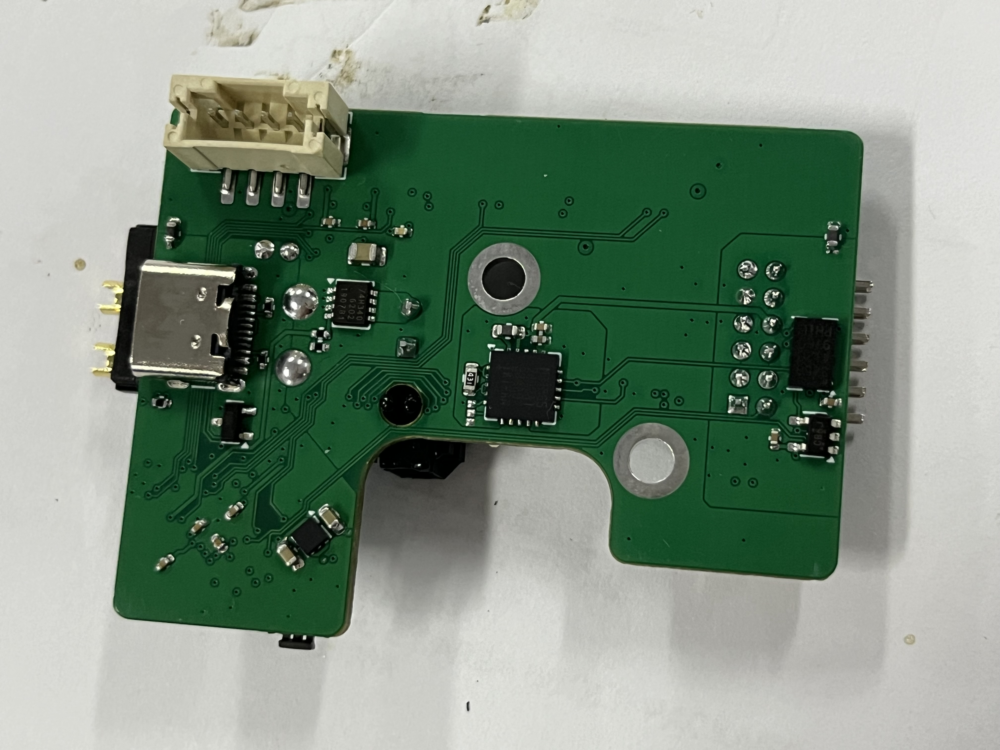
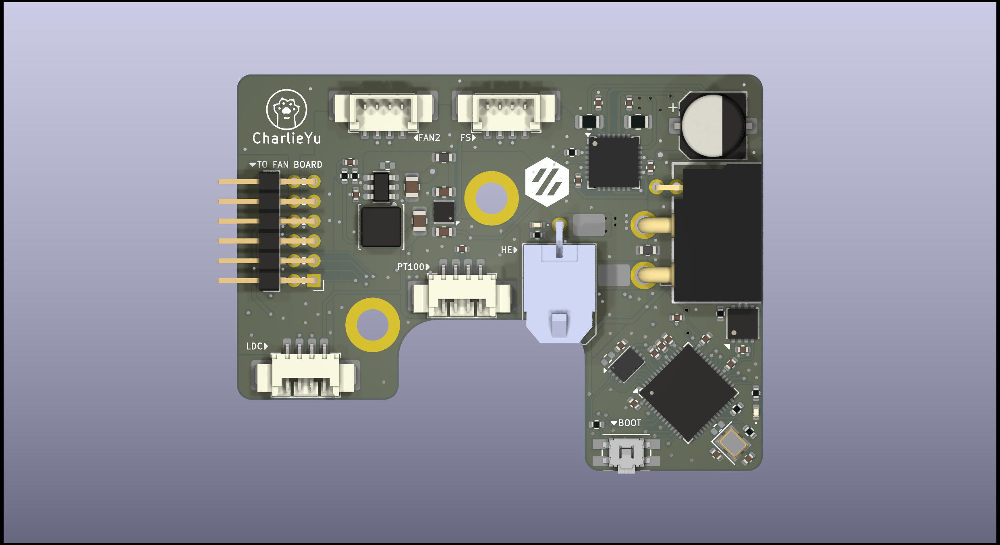
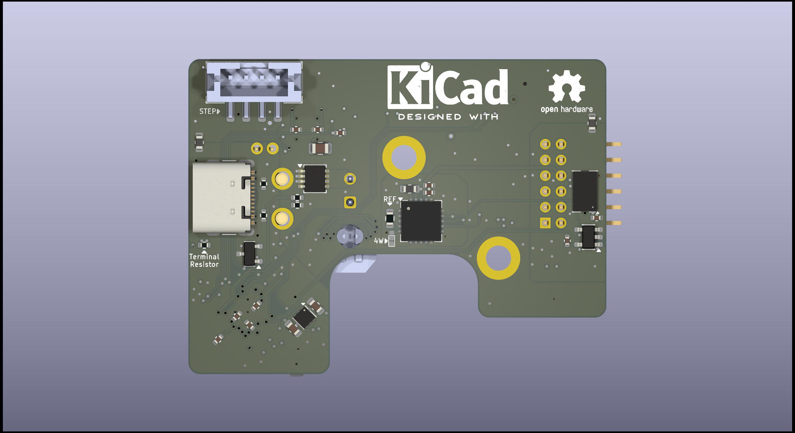

# SB_CAN (StealthBurner_CAN)
为 Voron Design 的 StealthBurner 设计的工具头 PCB 板

## 特点
+ 使用 StealthBurner 官方的固定孔位，可以无损兼容现有打印件
+ 使用 CAN 总线与主控制器通讯，可靠性更好
+ 板载 ADXL345，无需另外安装加速度计就可以做共振补偿
+ 板载 MAX31865，可以使用三线制 PT100 温度传感器
+ 板载 TMP235，可以做仓温监控
+ 板载三路四线风扇接口，可以监控风扇转速
+ 预留线性霍尔提供耗材直径检测
+ 预留一路 I2C 接口，可以使用 LDC1612 IDM 传感器

## 使用

### 打样
使用各文件夹内的「SB-**-board.zip」文件即可，建议使用 1.6mm 板厚，4mil 最小线宽

### 接线 (均为从左向右)

+ FAN2 (风扇2)
  + +24V
  + GPIO0
  + GPIO1
  + GND
+ FS (耗材传感器)
  + +3.3V
  + GPIO16
  + ADC2
  + GND
+ LDC (LDC1612)
  + GND
  + GPIO4
  + GPIO5
  + +5V
+ PT100
  + FORCE-
  + RTDIN-
  + RTDIN+
  + FORCE+
+ HS (上下)
  + GND (GPIO17)
  + +24V

+ STEP
  + A-
  + A+
  + B+
  + B-